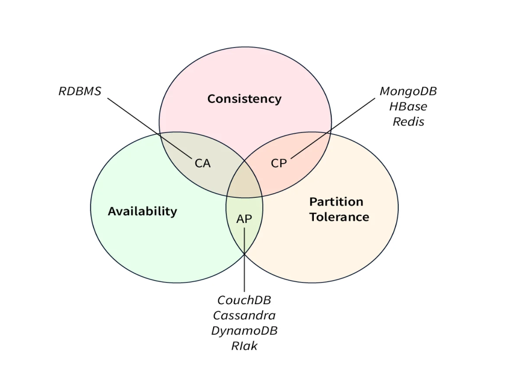

# CAP теорема

## Цель:
	В результате выполнения ДЗ вы научитесь работать с гитом.

## Описание/Пошаговая инструкция выполнения домашнего задания:
	Необходимо написать к каким системам по CAP теореме относится MongoDB.
	ДЗ сдается ссылкой на гит, где расположен миниотчет в маркдауне.

## Критерии оценки:
	- Задание выполнено - 10 баллов
	- Предложено красивое решение - плюс 2 балла
	- Предложено рабочее решение, но не устранены недостатки, указанные преподавателем - минус 2 балла

### Компетенции:
  - Теория баз данных
    - CAP теорема
    - CP системы RAFT, PAXOS
    - PA системы. GOSSIP, CasPAXOS

### Дополнительные материалы:
   - [Всё, что вы не знали о CAP теореме](https://habr.com/ru/post/328792/)
   - [Мифы о CAP теореме](https://habr.com/ru/post/322276/)

## The CAP Theorem MongoDB

_"In the context of the CAP Theorem MongoDB, MongoDB is often [classified as an *AP*](https://www.scaler.com/topics/cap-theorem-mongodb/) (Availability/Partition tolerance) database. MongoDB prioritizes availability and partition tolerance over strong consistency.

- MongoDB achieves high availability by using a distributed architecturethat allows for replica sets. A replica set consists of multiple MongoDB instances, where one acts as the primary node handling write operations and the others serve as secondary nodes replicating the data from the primary. In the event of a primary node failure or network partition, one of the secondary nodes can be elected as the new primary, ensuring continuous availability.
- Regarding partition tolerance, MongoDB is designed to handle network partitions and maintain system operation even when nodes are disconnected. The data replication mechanism allows for eventual consistency across the replica set. Updates made to the primary node are asynchronously replicated to the secondary nodes, and there may be a delay before all nodes have the same view of the data.
- However, it's important to note that MongoDB provides configurable consistency levels. While it prioritizes availability and partition tolerance by default, it offers options to enforce stronger consistency guarantees based on application requirements. MongoDB provides read and write concerns that allow developers to specify the level of consistency they need for specific operations."_

(мой перевод)
В контексте *теоремы CAP* _MongoDB_  часто классифицируется как база данных *AP* (доступность/разделение). *MongoDB* отдает _приоритет доступности и устойчивости_ разделов над строгой согласованностью.
- MongoDB обеспечивает высокую доступность за счет использования _распределенной архитектуры_, которая позволяет использовать наборы реплик. Набор реплик состоит из нескольких экземпляров MongoDB, один из которых выступает в качестве основного узла, обрабатывающего операции записи, а другие служат второстепенными узлами, реплицирующими данные из основного. В случае сбоя основного узла или разделения сети один из вторичных узлов может быть выбран в качестве нового основного, обеспечивая непрерывную доступность.
- Что касается толерантности к разделению, MongoDB предназначен для обработки сетевых разделов и поддержания работы системы даже при отключении узлов. Механизм репликации данных обеспечивает конечную согласованность всего набора реплик. Обновления, внесенные в основной узел, асинхронно реплицируются на вторичные узлы, и может возникнуть задержка, прежде чем все узлы получат одинаковое представление данных.
- Однако важно отметить, что _MongoDB предоставляет настраиваемые уровни согласованности_. Хотя по умолчанию он отдает приоритет доступности и устойчивости разделов, он предлагает возможности для обеспечения более строгих гарантий согласованности на основе требований приложения. MongoDB предоставляет возможности чтения и записи, которые позволяют разработчикам указывать уровень согласованности, необходимый им для конкретных операций.

